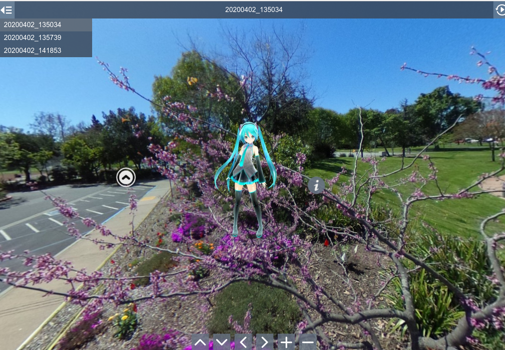

# Marzipano Test with RICOH THETA Images

## [Go to Demo](https://codetricity.github.io/theta-miku/)

This is a virtual tour demo of RICOH THETA images 
built using the 
[Marzipano Tool](https://www.marzipano.net/).

The character is inserted into the 360 image using the 
[RICOH THETA SC Type Hatsune Miku camera and app](https://community.theta360.guide/t/hands-on-review-of-ricoh-theta-sc-type-hatsune-miku-camera-and-app/2591?u=craig).  This
was a special edition RICOH THETA SC that I used for
evaluation of the impressive software that was built for the 
camera.

### Set Default Position of Each Image

Set the first view of each image you upload. 

### Info Pop-up Boxes

You can easily add info boxes to your virtual tour.

### Add Navigational Arrows

The navigational arrows function like Google Streetview.  You can move
between pictures easily.

### Auto-Rotate Image Spheres

Set images to auto-rotate or pause the rotation.

